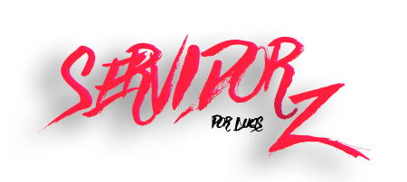

# Site para Servidor de DayZ


>

<center></center>

> Site para servidor de Dayz com loja integrada.

### Tarefas e Feitos:

O projeto ainda está em desenvolvimento e as próximas atualizações serão voltadas nas seguintes tarefas:

- [x] Pagina Inicial.
- [x] Sistema de Login.
- [x] Sistema de Blog.
- [x] Sistema de Anuncios.
- [x] Sistema de Loja.
- [x] Pagina de Clãs.
- [x] Sistema de ativar produto por key.
- [x] Sistema de Moedas.
- [x] Conexão com o Discord.
- [x] Area do Player.
- [ ] Area do Moderador.
- [x] Area do Administrador.
- [ ] Conexão com o Servidor.


## 💻 Segurança dos Sistemas

O site está completamente seguro contra invasões SQL Inject, todos os dados cadastrados no banco de dados do site são encryptografados.
* Feito em `<HTML5 / PHP / SQL>`.
* Encriptografia usada `<MD5 / SHA1 >`.
* Banco de Dados `<SQL>`.

## 🚀 Ideas Futuras

Em desenvolvimento:
```
Mod para conectar o Servidor ao site.
Bot para Discord de Vendas integrado com o site.
Entrega automatica de VIPs, vendidos pelo site.
```


## ☕ Usando o projeto
```
Atualmente não existe nenhum servidor de DayZ que utilize este site.
Site e sistemas unicos e desenvolvidos por Luqs.
```


## 🤝 Creditos

<table>
  <tr>
    <td align="center">
      <a href="#">
        <br>
        <sub>
          <b>Luqs</b>
        </sub>
      </a>
    </td>
  </tr>
</table>


## 😄 Gostou do site?<br>

Gostou do site? Entre em contato comigo pelo Discord <strong>Luqs#0019</strong>

## 📷 Screenshorts do Site

Entre em contato comigo pelo Discord que te mostro o site 🤩

<br>
